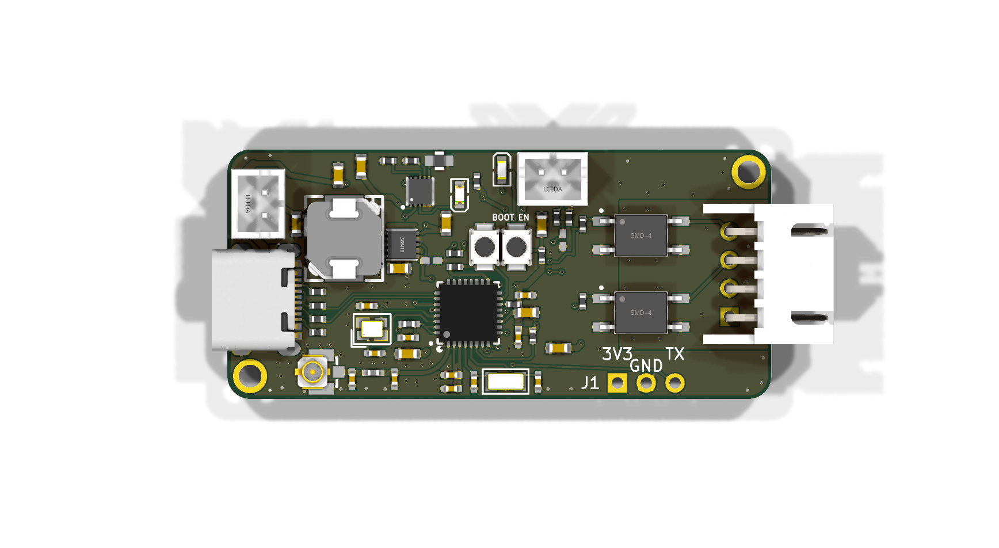
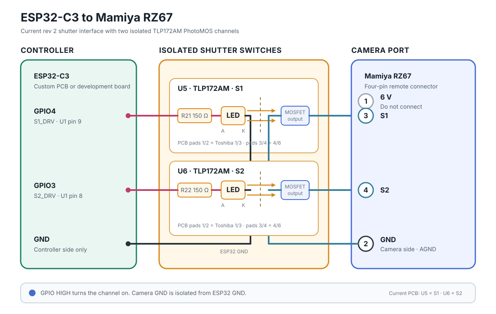

# openrz67-trigger

ESP32 firmware for remote-triggering the Mamiya RZ67 analog camera over Bluetooth LE. It runs on an ESP32-C3 connected to the camera's electrical remote port and is controlled from the companion Android app, [openrz67-android](https://github.com/openrz67/openrz67-android).

## Features

* Instant shutter release
* Bulb mode for remote long exposures
* Self-timer countdown with app-configurable duration
* Power-optimized: 80 MHz CPU clock and 0 dBm BLE TX power, running off a small LiPo (automatic light sleep is not available in the Arduino framework build, see `platformio.ini`)

## Hardware

The current prototype is a custom PCB (design and fabrication files in [`pcb/`](pcb/)):



The PCB source is the KiCad project in [`pcb/kicad/`](pcb/kicad/) (ported from EasyEDA Pro in September 2026). Generated Gerber/BOM/position files are in `pcb/kicad/out/`. Each ordered revision's upload package and the EasyEDA Pro exports are kept under [`pcb/archive/`](pcb/archive/).

The built boards are **rev 2**, ordered 2026-09-07 and **verified working 2026-09-14** (USB and battery power, BLE, shutter trigger); the source is now **rev 3** (routing fixes, R23, battery voltage sense on GPIO3 with S2 moved to GPIO6), not yet ordered; what was sent to the fab is in [`pcb/archive/`](pcb/archive/). Rev 2 swaps the G6K relays for PhotoMOS parts, changes `U4` to a side-entry connector and replaces the 1 A LGS5500 charger/boost and LDO with a BQ25185 charger (111 mA) and a TPS63031 buck-boost; the battery connector stays on top. The board pictured above is rev 2, and the enclosure in [`case/`](case/) is drawn for it (first print 2026-09-14). Connector part numbers and geometry are documented in [`pcb/kicad/README.md`](pcb/kicad/README.md), which is the authoritative source for them.

* 1× ESP32-C3FH4
* 2× Toshiba TLP172AM PhotoMOS relays (solid-state, isolated) to close the shutter contacts
* Supporting components per the [BOM](pcb/kicad/out/openrz67-bom.csv)
* 2.4 GHz antenna with U.FL connector
* 250 mAh LiPo for power, on a JST B2B-PH-K-S top-entry connector (`BAT1`); charged at 111 mA by a TI BQ25185 (the cell is rated for 120 mA), with a TPS63031 buck-boost holding 3.3 V from USB or battery
* KCD11 mini rocker switch (snap-in, 2.8 mm tabs) on `S3`; every off-board part (cell, switch, antenna, cables) is in [BOM.md](BOM.md)
* Unpopulated header `J1` along the bottom edge for bench logging and experiments: 1×4 (3V3, GND, GPIO21/TX, GPIO6) on rev 2, 1×3 (3V3, GND, GPIO21/TX) in rev 3 since GPIO6 drives the S2 relay there

The solution is flexible: an ESP32-C3 development board such as the Seeed XIAO ESP32C3 and two isolated switch channels work too. Assign two output-capable GPIOs in `src/main.cpp`. On the PCB each channel is a TLP172AM PhotoMOS relay whose LED is driven from the GPIO through 150 Ω; the isolated output closes S1 or S2 to camera ground while the GPIO is HIGH. Keep ESP32 ground and camera ground separate.



### Current PCB pinout

| GPIO | Rev 2 (built) | Rev 3 (source, not ordered) |
|------|---------------|-----------------------------|
| 3    | Shutter output S2 (U6), net `S2_DRV` | Battery sense, net `VBAT_SENSE`: `SW_SYS` through 1 MΩ / 1 MΩ (R24/R25) + 100 nF (C32), ×2 = cell voltage on battery, BQ25185 SYS voltage on USB |
| 4    | Shutter output S1 (U5), net `S1_DRV` | same |
| 6    | `J1` pin 4, spare | Shutter output S2 (U6), net `S2_DRV` (`J1` shrinks to 1×3) |
| 20   | Status LED (`D4`, blue) | same |

The firmware covers every revision through build flags: `S1_PIN` (rev 1), `S2_PIN` and `VBAT_ADC_PIN` (rev 3); see the `rev1` and `rev3` envs in `platformio.ini`.

### LEDs

Both LEDs sit under the same light-pipe window in the lid.

| LED | Meaning |
|-----|---------|
| Red `D3`, steady | Charging. Driven by the charger IC, so it works with the power switch off. Off = full, no USB, or fault |
| Blue `D4`, slow soft pulse | On, waiting for a phone |
| Blue `D4`, dim steady | Phone connected |
| Blue `D4`, full steady | Trigger pulse (2 s) or bulb exposure |
| Blue `D4`, fast blink | Countdown running |

### Camera connector

The custom PCB uses a JST S4B-XH-A four-pin header (`U4`), side-entry, opening out of the right board edge:

| U4 pin | Camera signal |
|--------|---------------|
| 1      | Not connected (camera 6 V) |
| 2      | GND |
| 3      | S1 |
| 4      | S2 |

Verify the pin 1 orientation before assembling the camera cable.

## Camera connection

Viewed from the front, the camera's four-pin remote-control port is:

1. 6 V — do not connect
2. GND
3. S1 switch
4. S2 switch

To trigger the shutter release, the PhotoMOS outputs short S1/S2 to camera GND. For bulb exposures, set the camera's shutter-speed dial to `B`. The camera closes the shutter automatically after approximately 60 seconds even if the switches remain closed.

## BLE protocol

The device advertises as `OpenRZ67` with service UUID `c9239c9e-6fc9-4168-b3aa-53105eb990b0` and characteristic `458d4dc9-349f-401d-b092-a2b1c55f5319`. Send commands using Write Without Response.

On rev 3 boards there is a second characteristic `cda71ce6-4af9-4aa2-8d34-329c2acdae09` (read + notify): the `SW_SYS` voltage in millivolts as a little-endian `uint16`, refreshed every 10 s. On battery this is the cell voltage (about 4200 full, 3500 low); on USB it is the BQ25185 SYS regulation voltage, which is higher. It is a system voltage, not a USB-present flag: a full cell (4200 nominal) and a USB-powered SYS rail overlap once charger tolerance, the 1 % divider and the ADC's ±70 mV are added up, and DPPM or supplement mode can pull SYS down with USB still plugged in. A high reading suggests USB; treat roughly 4250–4350 as undecided, and use hysteresis if a client acts on it. Certain USB status needs a separate signal.

**Single-byte commands** (value = button × 10 + state):

| Value | Action |
|-------|--------|
| 11 | Trigger shutter with a 100 ms pulse |
| 10 | Clear status LED; no shutter action |
| 21 | Start bulb mode: holds S1/S2 closed until 20 is sent. Camera dial must be on `B`, otherwise this is just one normal exposure |
| 20 | End bulb mode |
| 31 | Start countdown with the default duration of 10 s |
| 30 | Cancel countdown |

**Three-byte commands** `[command, duration, action]`:

| Bytes | Action |
|-------|--------|
| `[3, n, 1]` | Start countdown of *n* seconds (`1–255`) |
| `[3, _, 0]` | Cancel countdown |

Starting a trigger or bulb exposure cancels any pending countdown.

## Building

The project uses [PlatformIO](https://platformio.org/) and the `esp32-c3-devkitm-1` board definition:

```bash
pio run
pio run -t upload
```

If uploading does not start, hold `BOOT`, press and release `EN`, then release `BOOT` and retry.

For a rev 1 board (S1 on GPIO 21 instead of GPIO 4), flash the `rev1` env: `pio run -e rev1 -t upload`. For a rev 3 board (S2 on GPIO 6, battery sense on GPIO 3), flash `rev3` or `rev3-debug`: `pio run -e rev3 -t upload`. The default env is rev 2; the board revision is only a set of `-D` pin flags in `platformio.ini`.

The production build has no serial output. For logging, flash the `debug` env (`pio run -e debug -t upload`): it enables USB CDC on the USB-C connector and `VERBOSE=1`. UART0 is not used for logging because its RX pin (GPIO 20) drives the status LED; GPIO 21 (UART0 TX) is free since rev 2 and is on the `J1` header for a TX-only dongle if ever needed.

## License

[MIT](LICENSE), covering the firmware in `src/`, the KiCad design files in `pcb/kicad/`
and the enclosure sources in `case/`. MIT is written for software, but its grant is broad
enough to serve a hardware design; if you need an instrument written for hardware, the
closest equivalent is CERN-OHL-P.

Two things in this repository are **not** covered, because they are not mine to license:

* The footprints in `pcb/kicad/openrz67.pretty/` and the symbols in `openrz67.kicad_sym`
  were imported from the EasyEDA/LCSC part libraries.
* The 3D models in `pcb/kicad/openrz67.3dshapes/` were fetched per LCSC part number with
  `easyeda2kicad`.

Both are redistributed here for convenience under their originators' terms. Everything
else is mine.
