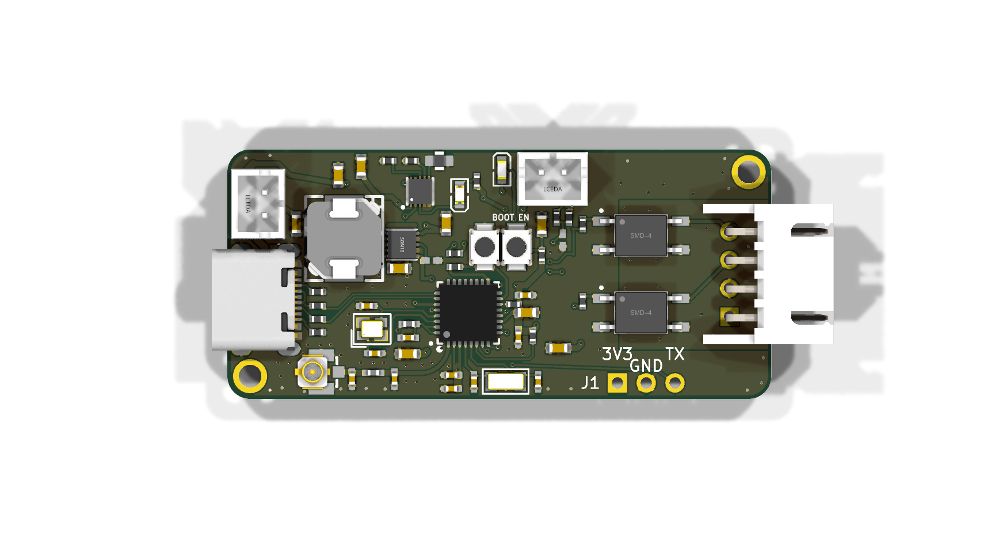
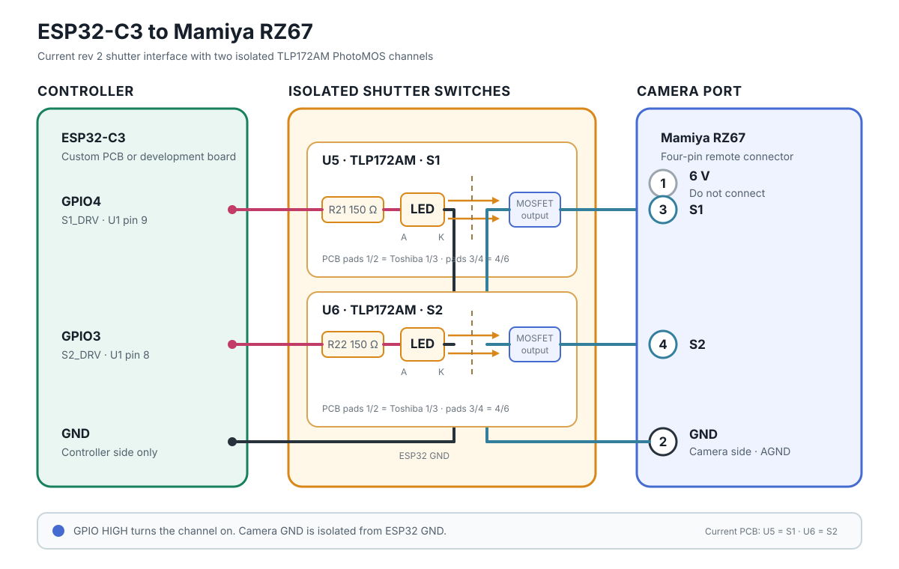

# openrz67-trigger

ESP32 firmware and hardware for remote-triggering the Mamiya RZ67 analog camera over
Bluetooth LE. It runs on an ESP32-C3 connected to the camera's electrical remote port and is
controlled from the companion apps, [openrz67-android](https://github.com/openrz67/openrz67-android)
and [openrz67-ios](https://github.com/openrz67/openrz67-ios).

## Features

* Instant shutter release
* Bulb mode for remote long exposures
* Self-timer countdown with app-configurable duration
* Runs off a small LiPo, with light sleep between BLE events (see [Power](#power))

## Hardware

A custom PCB in a 3D-printed case:



| Directory | What |
|---|---|
| [`pcb/kicad/`](pcb/kicad/) | KiCad source, generated fab files in `out/`, design history in `notes/` |
| [`pcb/archive/`](pcb/archive/) | exactly what was sent to the fab, one folder per order |
| [`case/`](case/) | parametric build123d enclosure |
| [`BOM.md`](BOM.md) | every part that is not soldered to the PCB (cell, switch, antenna, cables) |

The boards in use are **rev 2**, verified working. The source is **rev 3**, not yet fabricated;
the case fits both.

On the board:

* ESP32-C3FH4 with an FPC antenna on a U.FL connector
* 2× Toshiba TLP172AM PhotoMOS relays (solid-state, isolated) close the shutter contacts
* TI BQ25185 charger (111 mA) and TPS63031 buck-boost, 250 mAh LiPo on `BAT1`, reverse-battery
  P-FET (rev 3)
* KCD11 rocker power switch on `S3`
* `J1`, unpopulated header for bench logging: 3V3, GND, GPIO21/TX (plus GPIO6 on rev 2)

The firmware also runs on any ESP32-C3 board with two isolated switch channels: assign two
output-capable GPIOs in `src/main.cpp`. On the PCB each GPIO drives a PhotoMOS LED through
150 Ω; the isolated output closes S1 or S2 to camera ground while the GPIO is HIGH. Keep
ESP32 ground and camera ground separate.



### Pinout

| GPIO | Rev 2 (built) | Rev 3 (source) |
|------|---------------|----------------|
| 3    | Shutter output S2 (`S2_DRV`) | Battery sense (`VBAT_SENSE`): `SW_SYS` through a 1 MΩ / 1 MΩ divider |
| 4    | Shutter output S1 (`S1_DRV`) | same |
| 6    | `J1` pin 4, spare | Shutter output S2 (`S2_DRV`) |
| 20   | Status LED (`D4`, blue) | same |

The firmware covers every revision through build flags in `platformio.ini`: `S1_PIN` (rev 1),
`S2_PIN` and `VBAT_ADC_PIN` (rev 3).

### LEDs

Both LEDs sit under the same light pipe in the lid.

| LED | Meaning |
|-----|---------|
| Red `D3`, steady | Charging. Driven by the charger IC, so it works with the power switch off. Off = full, no USB, or fault |
| Blue `D4`, slow soft pulse | On, waiting for a phone |
| Blue `D4`, dim steady | Phone connected |
| Blue `D4`, full steady | Trigger pulse (2 s) or bulb exposure |
| Blue `D4`, fast blink | Countdown running |

### Camera connector

`U4` is a JST S4B-XH-A four-pin side-entry header, opening out of the right board edge:

| U4 pin | Camera signal |
|--------|---------------|
| 1      | Camera 6 V, unused by the board |
| 2      | GND |
| 3      | S1 |
| 4      | S2 |

Verify the pin 1 orientation before assembling the camera cable.

## Camera connection

Viewed from the front, the camera's four-pin remote-control port is:

1. 6 V — wired through, unused by the board
2. GND
3. S1 switch
4. S2 switch

To trigger the shutter, the PhotoMOS outputs short S1/S2 to camera GND. For bulb exposures,
set the shutter-speed dial to `B`. The camera closes the shutter by itself after about
60 seconds even if the switches stay closed.

## BLE protocol

The device advertises as `OpenRZ67` with service UUID `c9239c9e-6fc9-4168-b3aa-53105eb990b0`
and characteristic `458d4dc9-349f-401d-b092-a2b1c55f5319`. Send commands using Write Without
Response. The characteristic is open (no pairing): anyone in radio range can fire the camera,
which is accepted for a shutter release.

Also exposed: the standard Device Information Service (`0x180A`, firmware revision `0x2A26` =
`FW_VERSION` from `platformio.ini`), and on rev 3:

* characteristic `cda71ce6-4af9-4aa2-8d34-329c2acdae09` (read + notify): the `SW_SYS` voltage
  in millivolts, little-endian `uint16`, refreshed every 10 s. On battery this is the cell
  voltage (about 4200 full, 3500 low); on USB it is the charger's SYS voltage, which is higher.
  It is not a reliable USB-present flag: treat roughly 4250–4350 as undecided.
* Battery Service (`0x180F`, Battery Level `0x2A19`): the same reading as a percentage, linear
  from 3500 mV (0 %) to 4200 mV (100 %), which is what phones show without any app.

**Single-byte commands** (value = button × 10 + state):

| Value | Action |
|-------|--------|
| 11 | Trigger shutter with a 100 ms pulse |
| 10 | Clear status LED; no shutter action |
| 21 | Start bulb mode: holds S1/S2 closed until 20 is sent. Camera dial must be on `B` |
| 20 | End bulb mode |
| 31 | Start countdown with the default duration of 10 s |
| 30 | Cancel countdown |

**Three-byte commands** `[command, duration, action]`:

| Bytes | Action |
|-------|--------|
| `[3, n, 1]` | Start countdown of *n* seconds (`1–255`) |
| `[3, _, 0]` | Cancel countdown |

Starting a trigger or bulb exposure cancels any pending countdown. Commands are queued in
the BLE callback and executed in `loop()`, so the BLE stack never blocks on shutter timing.

## Building

[PlatformIO](https://platformio.org/) with the [pioarduino](https://github.com/pioarduino/platform-espressif32)
platform (Arduino core 3.3, ESP-IDF 5.5, NimBLE):

```bash
pio run
pio run -t upload
```

If uploading does not start, hold `BOOT`, press and release `EN`, then release `BOOT` and retry.

| Env | Board |
|---|---|
| default | rev 2 |
| `rev1` | rev 1 (S1 on GPIO 21) |
| `rev3`, `rev3-debug` | rev 3 (S2 on GPIO 6, battery sense on GPIO 3) |
| `debug` | rev 2 with USB CDC logging and `VERBOSE=1` |

The production build has no serial output. UART0 is not used for logging because its RX pin
(GPIO 20) drives the status LED; GPIO 21 (UART0 TX) is on `J1` for a TX-only dongle.

`pio check` runs cppcheck over `src/`; CI (`.github/workflows/firmware.yml`) builds every env
and runs it on each push.

## Power

The chip runs at 80 MHz with DFS down to 10 MHz, 0 dBm BLE TX power, and automatic light
sleep between BLE events: the radio wakes it for each one, so the phone connection stays up
and a trigger arrives as before. `custom_sdkconfig` in `platformio.ini` has pioarduino
rebuild the Arduino core with `CONFIG_PM_ENABLE`, tickless idle, BLE modem sleep and the
32.768 kHz crystal `X2` as the BLE low-power clock (the first build per machine takes a few
minutes). Consequences:

* The status LED runs on LEDC from `RC_FAST` in keep-alive mode, since the APB clock stops
  in light sleep.
* Light sleep releases every GPIO, so a PM lock keeps the chip awake while the shutter is
  open (bulb and the trigger pulse).
* The USB Serial/JTAG port drops off the bus in light sleep, so the `debug` env stays awake,
  and flashing a sleeping production build may need the `BOOT`/`EN` sequence above.

If `X2` does not start, ESP-IDF falls back to the internal RC and BLE keeps working without
light sleep. Current draw is not measured yet.

## License

[MIT](LICENSE), covering the firmware in `src/`, the KiCad design files in `pcb/kicad/` and
the enclosure sources in `case/`. MIT is written for software, but its grant is broad enough
to serve a hardware design; the closest hardware-specific equivalent is CERN-OHL-P.

Two things in this repository are **not** covered, because they are not mine to license:

* The footprints in `pcb/kicad/openrz67.pretty/` and the symbols in `openrz67.kicad_sym`
  were imported from the EasyEDA/LCSC part libraries.
* The 3D models in `pcb/kicad/openrz67.3dshapes/` were fetched per LCSC part number with
  `easyeda2kicad`.

Both are redistributed here for convenience under their originators' terms.

## Credits

The camera connector pinout that made this project possible was described to me by
Julio Ryuuzaki, who built and sold the Bluetooth [RZ Blue](https://ryuuzaki.jp/) trigger
for years. He answered a cold email in December 2022 with the essentials — four pins, one
ground, two live, one unconnected — and the warning that the camera closes the shutter by
itself after about a minute in bulb mode. Thank you.
